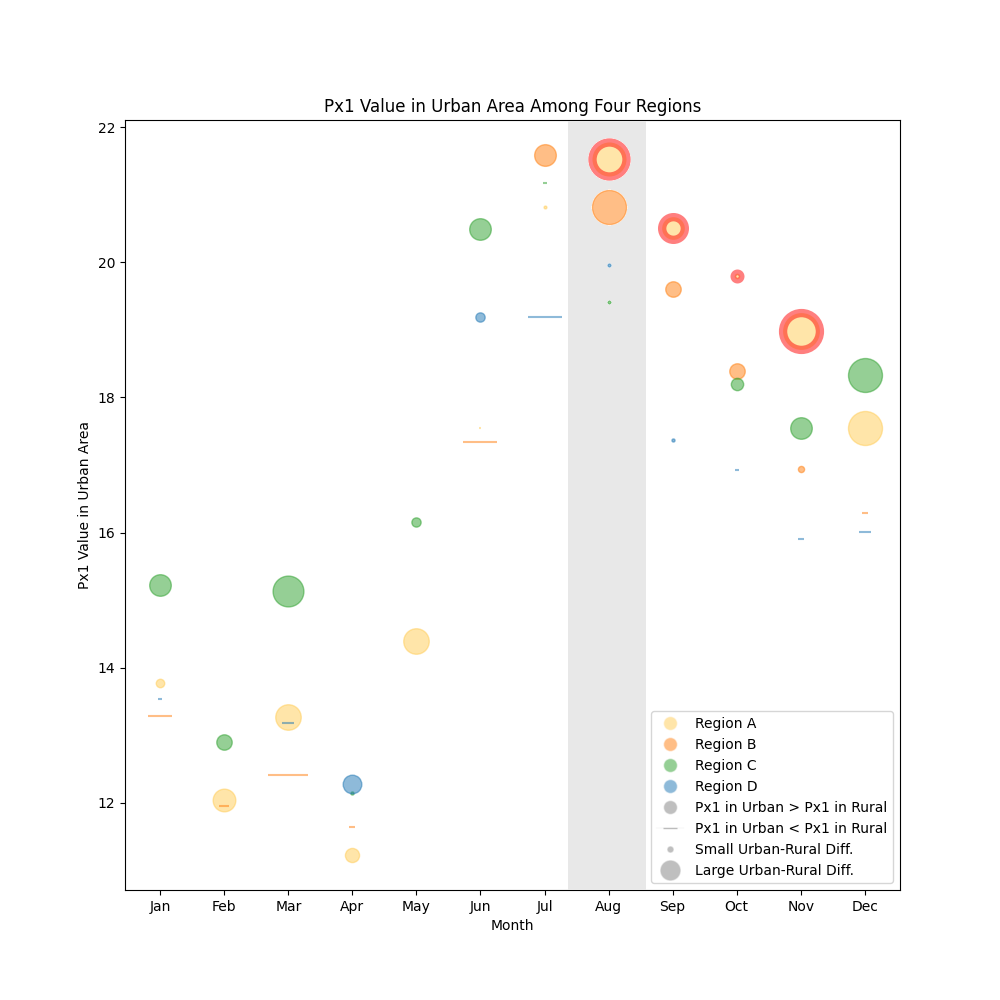

## Weather Visualization

#### Exercise Description

Using any software package you like, replot the weather information on one plot in an attempt to show "at-a-glance" what the authors have written in the following paragraph. Data tables will be posted at UM Learn. The goal of this is to create salient features (forms) to highlight at least 2 of the results described below

#### Paragraph Summary

- Regions A and B (i) show similar patterns of Px1 variations and (ii) exhibit relatively high values in August.
- Regions C and D (i) have high Px1 values in June and July.
- Region A is having a slightly higher Px1 mean in the urban areas than in the rural areas between 1961 and 2014.
- Regions A’s Px1 values in urban areas between August and November are higher than in other regions.
- Regions B’s Px1 values in urban areas between July and November are higher than in the rural areas in the same region.
- Regions C’s Px1 values in urban areas for all months except July are higher than in the rural areas in the same region.
- Regions D’s Px1 values in urban areas for seven months other than January, March, May, July, and December are higher than in the rural areas in the same regions,

#### Fields

- Regions (A,B,C,D) —> (a,b,c,d)
- Areas (Urban vs Rural)
- Months
- Px1 values
- Px1 mean

#### Solution

##### Plot

##### Captions

This aims to highlight the following two statements from the paragraph:

1. Regions A’s Px1 values in urban areas between August and November are higher than in other regions.
2. Regions A and B exhibit relatively high values in August.
